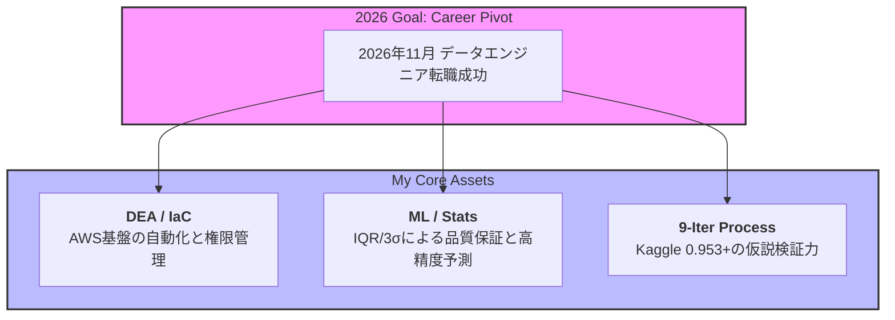

# 👨‍💻 Kou Sato (Moheji) | Data Engineer & ML Ops
### 「技術をビジネスのROI（投資対効果）へ翻訳する」

2026年11月のデータエンジニア職への転換を見据え、**「インフラのコード化(IaC)」**と**「統計的データ品質保証」**を垂直統合した、事業貢献直結型のアセットを構築しています。

---

## 🎯 Strategic Roadmap & High-Value Outcomes
各スプリントは、独立した学習ではなく、一貫した「実務へのデリバリー」を目的としています。

| Phase | Strategic Focus | Business Impact & Achievements | Status |
| :--- | :--- | :--- | :--- |
| **Sprint 1** | **[Infrastructure & DEA](https://github.com/kou-sato-ds/AWS_IaC_Terraform)** | **【インフラ自動化の結晶】**: TerraformによるS3データレイク構築。権限管理を徹底し、**環境構築のリードタイム削減とセキュリティのコード化**を実現。 | ✅ Done |
| **Sprint 2** | **[ML Pipeline (Bento)](https://github.com/kou-sato-ds/SIGNATE_Bento_Forecasting)** | **【実務型パイプライン】**: `X.align`による次元保証を実装。データドリフトを防ぎ、**予測の解釈性と運用安定性を数学的に担保**。 | ✅ Done |
| **Sprint 3** | **[Model Optimization](https://github.com/kou-sato-ds/Kaggle-Playground-S6E2-Heart-Disease-Prediction---9-iterations-of-Trial-Error)** | **【Kaggle Score: 0.95337】**: 9回に及ぶ反復的な仮説検証。アンサンブル手法を用い、**未知のデータに対する高い堅牢性**を証明。 | ✅ Done |

---

## 🛠️ Roadmap Visualization

---

## 📈 Engineering Insight (ADR: Architectural Decision Records)

> **「なぜ、一貫して『型』と『統計的根拠』の徹底に重きを置くのか」**
> 実務において最もコストがかかるのは「動かないコード」ではなく「間違った判断をさせるデータ」です。私はKaggleでのスコア向上プロセスを通じて、**「数学的根拠に基づいたクレンジング」**と**「IaCによる再現性の確保」**こそが、ビジネスにおける最大の防御であり攻撃であると確信しています。

---

## 📬 Contact
- **GitHub**: [https://github.com/kou-sato-ds](https://github.com/kou-sato-ds)
- **Desired Career**: Data Engineer / ML Ops Engineer (Available for Nov 2026)

© 2026 kou-sato-ds / Data Engineer Aspirant
