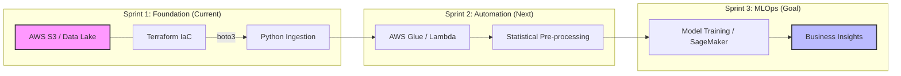

-----

# 🚀 Data Engineering & ML Ops Sprint 2026

2026年11月のデータエンジニア職への転換を見据え、\*\*「インフラのコード化(IaC)」**と**「統計的データ品質保証」\*\*を垂直統合した実戦的開発アセットを構築しています。

-----

## 🚀 2026 Strategic Development Sprint

現在の活動スパイクは、2026年11月の実務投入へ向けた「インフラ・統計・ML垂直統合」を目的とした、意図的な集中実装スプリントの成果です。

| Sprint | Period | Focus & Why | Status |
| :--- | :--- | :--- | :--- |
| **Sprint 1** | Q1 (Jan-Mar) | **Infrastructure & Stats**: データ品質を自動担保するS3/Terraform基盤と統計エンジンの構築 | ✅ Done |
| **Sprint 2** | Q2 (Apr-Jun) | **Serverless ETL**: AWS Glue/Lambdaを用いた統計ロジックのサーバーレス化と自動化 | 🏃 In Progress |
| **Sprint 3** | Q3 (Jul-Sep) | **MLOps Integration**: SageMakerを用いたエンドツーエンドのMLパイプライン構築 | 📅 Planned |

### 🛠️ Roadmap Visualization

各スプリントがどのように繋がり、ビジネス価値を生むかのアーキテクチャ図です。

-----

## 🎯 Current Focus: 2026 Spring Implementation Sprint

蓄積したデータサイエンスの知見を、実務レベルのコード（MLパイプライン・IaC）へ変換する「集中実装スプリント」を実施中です。

  - **テーマ**: データの整合性保証、再現性の高いインフラ構築、および「黄金の型」の確立
  - **コアバリュー**: 単なる実装に留まらず、\*\*「なぜその手法を選んだか」\*\*という数学的・技術的根拠のドキュメント化を徹底。

-----

## 🛠️ Technical Stack & Ecosystem

-----

## 📂 Active Projects

| 分野 | プロジェクト (Link) | 実装の核心 (Core Achievements) | Status |
| :--- | :--- | :--- | :---: |
| **Data Engineering** | [01\_DEA: AWS Infrastructure](https://www.google.com/search?q=./01_DEA) | **Terraform**によるS3データレイクの自動構築。権限管理とスケーラビリティを考慮したIaC実装。 | ✅ |
| **Data Science** | [02\_Statistics\_L2: Data Quality](https://www.google.com/search?q=./02_Statistics_L2) | **1.5xIQR / 3σ法**を用いた統計的異常値検知。データ標準化（Z-score）による多変量解析の基盤構築。 | ✅ |
| **ML Engineering** | (Under Construction) | モデルデプロイ、パイプラインの自動化、モニタリングの実装予定。 | 🚧 |

-----

## 📈 Latest Insight (2026/03/20)

> **「統計的根拠に基づくデータクレンジングの自動化」**
> データ前処理において、属人的な「なんとなく」の判断を排除するため、IQR法と3σ法を組み合わせた異常値検知フローを確立しました。これにより、後続のMLモデルの精度と信頼性を数学的に担保しています。

-----

## 📬 Contact

  - **GitHub**: [[https://github.com/kou-sato-ds](https://github.com/kou-sato-ds)]
  - **LinkedIn**: [準備中]

© 2026 kou-sato-ds / Data Engineer Aspirant

-----
